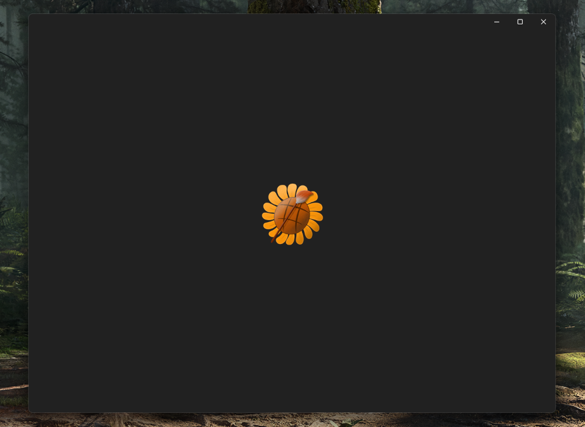

## 备忘录

### UWP 和 WinUI 3 的视觉资源

> 在 Visual Studio 的 Package.appmanifest 设计器界面中取消勾选 "应用建议的填充"，将应用图标按照 1:1 裁剪到内容，并按照如下所示的比例来导出图片，可以在各个位置看起来都比较和谐。

#### 1. 小磁贴：75%

> 小磁贴下增加图标所占空间，以此提高可见性。

<div>

</div>

#### 2. 中磁贴、宽磁贴、大磁贴：50%

> 这三种磁贴相比于小磁贴都更加易读，因此图标所占空间相对较少，视觉上更加协调。

<div>

</div>

#### 3. 应用图标：100%

> 应用图标更倾向于占满，这样显示在开始菜单和任务管理器等位置时会更加清晰，尤其是任务管理器中的小图标，如果图标留有边距的话，会更加难以看清。缺点是在 "设置" - "安装的应用" 列表中应用图标会有一个没有内边距的底色框，看起来不和谐。

#### 4. 启动图标：40%

> UWP 应用启动时默认会显示启动图标。

<div>

</div>

#### 5. 商店图标：60%

> 如果上架应用商店时没有特别设置展示图标，则会使用这个图标，它会显示在应用商店的各个位置，并被应用商店添加外边框；比例不宜过高，会让图标与外边框太近，也不宜过低，在应用详情页中会很不协调。

<div>

</div>

---

### 关于 WinUI 3 打包
WinUI 3 目前不像 UWP 支持直接打出 appxbundle、msixbundle 这种类型的包，需要自己手动打出 x64 和 ARM64 的 msix 包，然后这样操作：
将这两个 msix 文件放到例如 C 盘根目录的 Source 文件夹内(不能有其他文件)，然后管理员运行终端如下命令：

```
 "C:\Program Files (x86)\Windows Kits\10\bin\10.0.22621.0\x86\MakeAppx.exe" bundle /d "C:\Source" /p C:\out.msixbundle
```

这样就可以得到一个 msixbundle 包用来上传微软商店了

---

### 自包含依赖项
在 `.csproj` 文件添加如下

```
<WindowsAppSDKSelfContained>true</WindowsAppSDKSelfContained>
<SelfContained>true</SelfContained>
```

这样打的包才会附带运行时，否则在一些电脑上运行时会弹出弹窗，称需要安装或更新 .Net 才可以运行此软件 (Microsoft.NETCore.App)

---

### UWP 或 WinUI 3 项目证书文件丢失

打开项目的 `csproj` 文件，找到 `PackageCertificateThumbprint` 和 `PackageCertificateKeyFile` 这两项，删掉，然后在 `项目-发布` 里面关联一下商店就会重新生成

---
