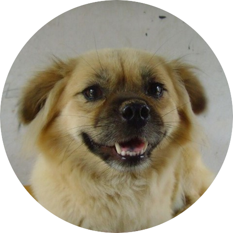

    <b>sh0ckj0ckey</b>

    <i>Better to run than curse the road.</i>

---

<h3>还要做这些...</h3>
<ol>
<li>密罐，剩下这两点做好就可以发布啦</li>
<ol>
<li>编辑功能</li>
<li>数据迁移功能</li>
</ol>
<li>废时，功能极其简单，就图个好玩好看</li>
<ol>
<li>画一个图标</li>
<li>画好多鱼</li>
<li>实现简单的功能</li>
</ol>
<li>图蝶，使用 WinUI 2 重置
<ol>
<li>画一个新的图标</li>
<li>功能和界面完全重做</li>
</ol>
</li>
<li>燧石，继续增加功能</li>
<ol>
<li>快捷键唤出搜索窗口而非完整窗口</li>
<li>支持联网查询</li>
<li>或许可以再增加句子翻译、屏幕取词</li>
</ol>
<li>Overlook，这个估计要做一年</li>
<ol>
<li>画一个图标✅</li>
<li>功能逐渐完善</li>
</ol>
</ol>