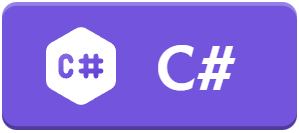
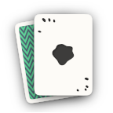

### Yao Yiming

<i>Better to run than curse the road.</i>

  
  
  
  
  
  

  
  
  
  

#### [© NoMewing](https://apps.microsoft.com/search/publisher?name=No+Mewing)

<table>

<tr>
<td>

</td>
<td>

</td>
<td>

</td>
<td>

</td>
</tr>

<tr>
<td align="center">

[Overlook](https://github.com/sh0ckj0ckey/Overlook)

</td>
<td align="center">

[Dotahold](https://github.com/sh0ckj0ckey/Dotahold)

</td>
<td align="center">

[燧石](https://github.com/sh0ckj0ckey/Flint)

</td>
<td align="center">

[墨水渍](https://github.com/sh0ckj0ckey/Tintenklecks)

</td>
</tr>

<tr>
<td>

</td>
<td>

</td>
<td>

</td>
<td>

</td>
</tr>

<tr>
<td align="center">

[暇墨](https://github.com/sh0ckj0ckey/Summer)

</td>
<td align="center">

[莺歌](https://github.com/sh0ckj0ckey/Winter)

</td>
<td align="center">

[废时](https://github.com/sh0ckj0ckey/FishTime)

</td>
<td align="center">

[密罐](https://github.com/sh0ckj0ckey/Honeypot)

</td>
</tr>

<tr>
<td>

</td>
<td>

</td>
<td>

</td>
<td>

</td>
</tr>

<tr>
<td align="center">

[Conscripts](https://github.com/sh0ckj0ckey/Conscripts)

</td>
<td align="center">

[图蝶](https://github.com/sh0ckj0ckey/Picharm)

</td>
<td align="center">

[查颜观色](https://github.com/sh0ckj0ckey/Colors.Rainbow)

</td>
<td align="center">

</td>
</tr>
</table>
