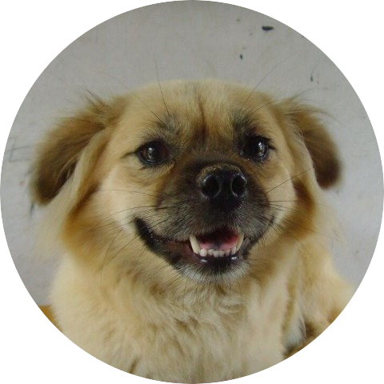
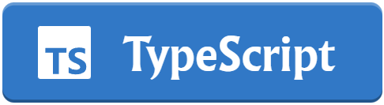
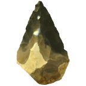
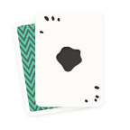
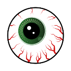
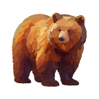
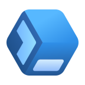
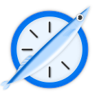

### Yao Yiming

<i>Better to run than curse the road.</i>

  
  
  
  
  
  

  
  
  
  

#### [© No Mewing](https://apps.microsoft.com/search/publisher?name=No+Mewing)

| Apps                                                                      |                                                                                                                                                                                                      |
| ------------------------------------------------------------------------- | ---------------------------------------------------------------------------------------------------------------------------------------------------------------------------------------------------- |
|          | <strong><a href="https://github.com/sh0ckj0ckey/Dotahold">Dotahold</a></strong>  A third-party Dota2 statistics app powered by OpenDota.                                                        |
|                | <strong><a href="https://github.com/sh0ckj0ckey/Flint">Flint 燧石</a></strong>  Flint is a fast, offline dictionary app for instant word lookup.                                                |
|  | <strong><a href="https://github.com/sh0ckj0ckey/Tintenklecks">Tintenklecks 墨水渍</a></strong>  Tintenklecks Gallery is the demo app for Tintenklecks UI, built with Electron and Vue 3.        |
|          | <strong><a href="https://github.com/sh0ckj0ckey/Overlook">Overlook</a></strong>  Overlook is planned to be a lightweight, simple, and bloodstained email app.                                   |
|          | <strong><a href="https://github.com/sh0ckj0ckey/Honeypot">Honeypot 密罐</a></strong>  Honeypot stores password records in a local SQLite database and includes a built-in password generator.   |
|      | <strong><a href="https://github.com/sh0ckj0ckey/Conscripts">Conscripts</a></strong>  A centralized launcher for managing and running BAT and PS1 scripts.                                       |
|              | <strong><a href="https://github.com/sh0ckj0ckey/Summer">Summer 暇墨</a></strong>  A clean sketchpad with shape recognition, background tracing, sketch export, and more.                        |
|              | <strong><a href="https://github.com/sh0ckj0ckey/Winter">Winter 莺歌</a></strong>  A local music player that lets you focus on what’s playing, with a media library and M3U8 playlist support.   |
|          | <strong><a href="https://github.com/sh0ckj0ckey/FishTime">FishTime 废时</a></strong>  FishTime is a fresh fish flavored countdown timer.                                                          |
|            | <strong><a href="https://github.com/sh0ckj0ckey/Picharm">Picharm 图蝶</a></strong>  Picharm is a third party app for browsing the Tuchong photography community.                                |
|     | <strong><a href="https://github.com/sh0ckj0ckey/Colors.Rainbow">Colors.Rainbow 查颜观色</a></strong>  Reflects Windows.UI.Colors into a browsable reference of built-in color names and values. |
